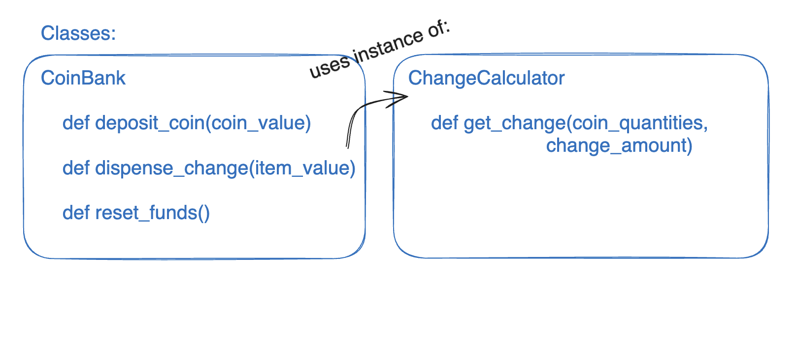
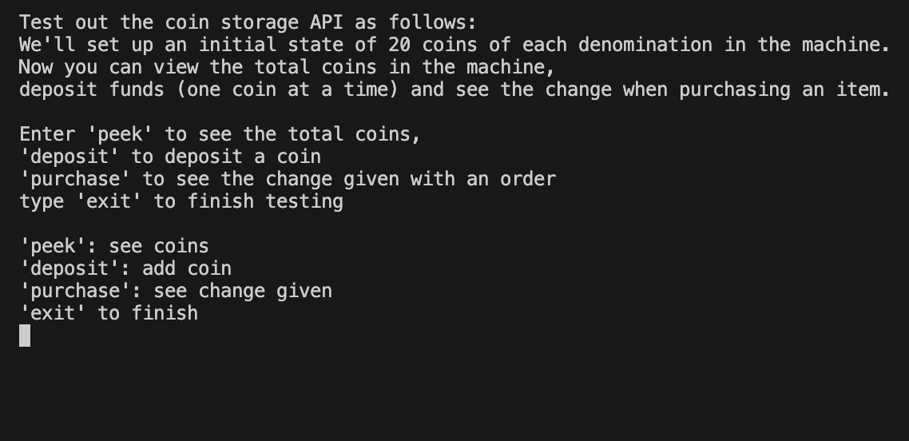

# Vending Machine Change Tracker

## Overview
This API is to be used in conjunction with vending machine software in order to track the coins inside the machine. It is to be set initially with the quantities of each coin denomination which are loaded into the machine and will then update these quantities as the user makes deposits and purchases.

## Design
We have two main problems to solve in constructing this program, keeping track of the coins inside of the machine and finding the correct change to be returned to a user when a purchase is made.

#### Class structure
My program structure includes the following two classes:
 - **CoinBank** which tracks the quantities of each coin inside the machine by updating the values as coins are entered by a user and change is returned.
 - **ChangeCalculator** which finds the coins required in change when a purchase is made based on the quantity of coins available and the amount to be returned.

Therefore, we have a CoinBank class which utilises the ChangeCalculator class. CoinBank is, therefore, dependent on ChangeCalculator since it calls a method on a change calculator instance from within it's dispense_change method. Below is a basic demonstration of the public interfaces of both classes:



As we can see, CoinBank has three main methods:
- **deposit_coin:** Updates the value of deposited_funds and increments the respective coin quantity in the hash.
- **dispense_change:** Removes the correct coins from the quantities hash and returns the change coins in an array.
- **reset_funds:** Returns the deposited_funds instance variable to 0.

And ChangeCalculator has one main method:
- **get_change:** Finds the coins to be returned from the machine based on the coin_quantities hash from the coin bank.

#### Usage
When creating a CoinBank instance, we must pass as arguments a ChangeCalculator instance and the initial float of coin quantities which are loaded into the machine. These keyword arguments (two_pound: 10, one_pound: 10, .. etc) are used to populate the coin_quantities hash. The change calculator is stored as an instance variable and is used in the dispense_change method of CoinBank.
Instances of ChangeCalculator are created with no initialisation arguments, and so the setup for creating a CoinBank instance to track the coins in a vending machine will look like this:
```ruby
change_calculator = ChangeCalculator.new()
coin_bank = CoinBank.new(
    change_calculator,
    two_pound: 5, one_pound: 5,
    fifty_p: 5, twenty_p: 5,
    ten_p: 5, five_p: 5,
    two_p: 5, one_p: 5
    )
```

**Design choices:**
- By using a ChangeCalculator class we are delegating the calculation of change to a seperate class so that this is more easily reusable should we require that functionality in another part of a wider application. It also ensures CoinBank has a single responsibility, and only updates the quantities without being concerned with how we calculate change.
- Initialising CoinBank instances with a ChangeCalculator instance means that CoinBank does not need to create any instances for itself inside the class, making it less tightly dependent on ChangeCalculator (it only must know that there is a get_change method which it calls), and this also makes unit testing easier since we are able to mock the ChangeCalculator behaviour and pass it in for the purpose of unit testing CoinBank.
- The coin_quantities hash stored in a CoinBank instance is of the format {coin_value => quantity}, with the coin_value being the number of pence (£1 = 100, 2p = 2 for example). This means we can easily access the coins by their monetary value which can be used in the calculation of change.
- The CoinBank instances use keyword arguments to input quantities, which forces the programmer to be explicit when defining the initial quantity of each coin and also allows us to create a default quantity for a coin should they not input a value for each denomination.
- When we call get_change on a ChangeCalculator instance, a hash of coin_quantities is passed in from the coin bank. Therefore, we are not restricted by what object uses the ChangeCalculator, only that it must have an appropriate hash of coin values and quantities. It could be reused for a vending machine in a different country, for example, with different coin denominations.


**Edge cases:**
I have raised exceptions with appropriate messages for the following cases:

- The coin quantities when initialising a CoinBank instance aren't all integers >= 0.
- The value passed into the deposit method is not a valid coin denomnination.
- The value passed into the dispense_change method is not a valid monetary amount (i.e, not an integer >= 0).

And I have returned appropriate strings for the following cases (not raised exceptions):
- The item's value in the dispense_change method is greater than the amount that the user has deposited.
- The bank has run out of the right coin denominations in order to dispense the total amount of change necessary.

## Setup and use
```bash
# clone this repository and cd into it
git clone https://github.com/lplclaremont/vending-machine-challenge-ruby
cd vending-machine-challenge-ruby

# install dependencies using bundler
gem install bundler
bundle install
```

You can now create a ruby file and import the appropriate files as follows
```ruby
require 'change_calculator'
require 'coin_bank'

change_calculator = ChangeCalculator.new()

# initialises a coin bank with 20 coins of each denomination
coin_bank = CoinBank.new(
    change_calculator,
    two_pound: 20, one_pound: 20,
    fifty_p: 20, twenty_p: 20,
    ten_p: 20, five_p: 20,
    two_p: 20, one_p: 20
    )

# deposit coins (one coin at a time)
coin_bank.deposit_coin(20)   # 20p coin added
coin_bank.deposit_coin(100)   # £1 coin added
puts(coin_bank.deposited_funds)
# --> 120 (£1.20)

# get change for item purchase
change = coin_bank.dispense_change(105)  # item price --> £1.05
puts(change)
# --> [10, 5] (10 pence and 5 pence coins)

# return deposited funds to 0
coin_bank.reset_funds()
print(coin_bank.deposited_funds)
# --> 0
```

## Testing
#### RSpec
My rspec tests include CoinBank unit tests, ChangeCalculator unit tests and integration tests.
Run the following commands in order to run rspec tests
```bash
cd vending-machine-challenge-ruby
rspec
```

#### Interactive playground
In order to test the behaviour of my code, you can run the command line application in order to view the coins in the bank, make deposits and purchases and see the change that will be returned. Run it as follows
```bash
cd vending-machine-challenge-ruby
ruby dev_test_harness.rb
```
And you'll see the following instructions:

